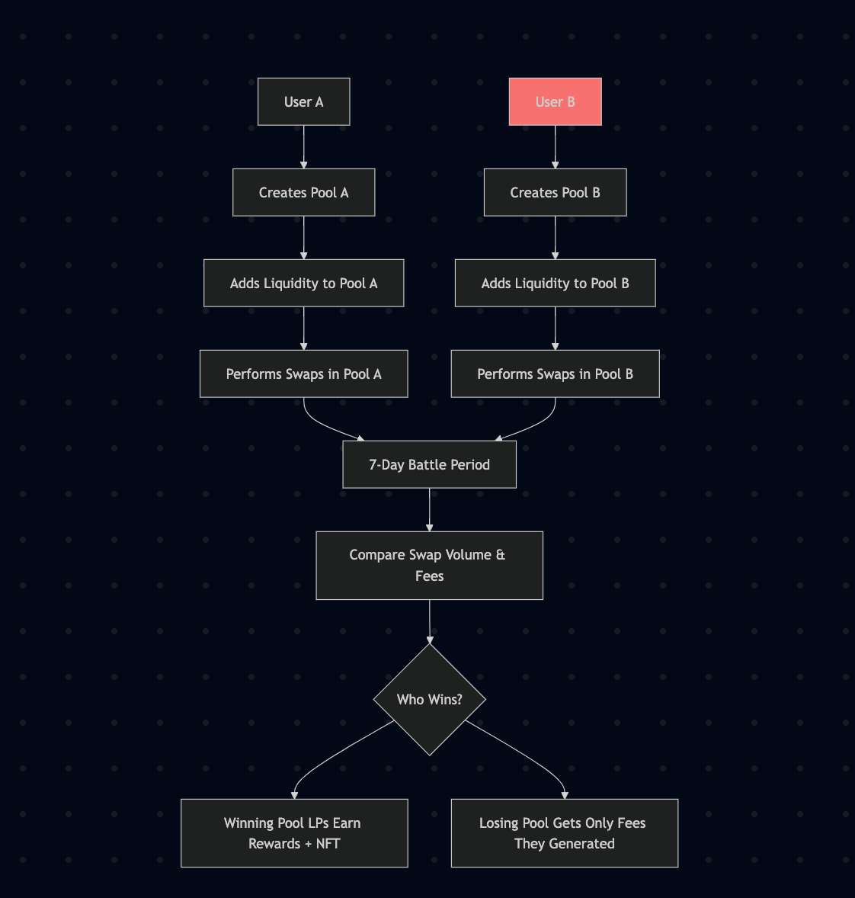

# 🥊 PvP DeFi Battles – “Battle of the Pools”

> A gamified DeFi system leveraging the Raydium Composability Library on `neondevnet`.

---

## ✅ Overview

This project explores the **Raydium composability library** and implements a creative use case: **PvP DeFi Battles**, where users compete in liquidity provision and swap activity to earn rewards.

Users create isolated Raydium-style AMM pools with identical token pairs, battle over 7-day epochs, and winners are rewarded with fees and NFTs.

---

## 📦 Deployment Summary

- **Network**: `neondevnet`
- **Deployer Address**: `0xAaA11D5b2873af87c887CaaBE05109e903F1be6a`
- **Deployer NEON Balance**: `5292.06 NEON`
- **Airdrop**: 100 NEON to `0x387bBE9fbeFA0864C93967fF0Db4fF4f3102922e`

### 🔹 Contract Deployment

| Parameter     | Value                                                              |
|--------------|--------------------------------------------------------------------|
| Contract      | `CallRaydiumProgram`                                               |
| Contract Address | `0x92725f157042D1F1b2Df37eA4888Fc150724D00d`                  |
| EVM Address   | `0x445E1b09649ee3E30dD83f5071F5d61636D094f9`                       |
| Token A       | `BTzkZLY1GmgFwLff2AyfyGfjbPLLQJKJtkrQAPQwuKf6`                     |
| Token B (WSOL)| `So11111111111111111111111111111111111111112`                     |
| ATA           | `H5kUgSCo5UuhqV62LRTyhwCmJpsuQHotM5YUVMhD9Sm2`                     |
| Program       | `LibRaydiumProgram`                                               |
| Balance       | `4210.71 NEON`                                                    |

### 🧾 Transactions

- **Create Pool**: `0x4c9b2093cea56f086f6e5ae9b212df608432b3bcb3c42cb81da940ea86cc8716`
- **Add Liquidity**: `0x8b7946df5954efc0fd7f6cc28bc633cff1906da1552cbf71074164986897aba1`
- **Withdraw Liquidity**: `0x8e48887cadbad7326876972037c437c2f46d4f2dfd6fc7f72da54f872e6b779d`
- **Lock Liquidity (with metadata)**: `0x6a69f65be5e721981646a746ed727b418d584d230ef30e718abdb988cc6ed515`
- **Lock Liquidity (without metadata)**: `0x83eef9adef1beaa9971883e95b3b12fba44aac213af23d3d8263406e78397bf8`
- **Swap Input**: `0x613a89550a608ddd7be1a1e6a86350817d5783b64e35a68708032ae709bf0aa9`
- **Swap Output**: `0x1055d88c16f9f0f3f1e9edc0888a24ce202240a0f6a368f73417e6ee07e36ba8`
- **Collect Fees**: `0x56523e2f11b02188164fd45abd5aa120fc28fe00459b5eb78300ff606cea7993`

---

## ⚔️ Use Case: PvP DeFi Battles – “Battle of the Pools”

### 📘 Concept

Two (or more) users create **identical token-pair liquidity pools** on Raydium. Over a 7-day epoch, participants compete by generating:

- 🌀 Highest **swap volume**  
- 💰 Highest **accumulated fees**  
- 🧠 Most **strategic liquidity actions**

At the end of the epoch:
- The **winning pool** earns rewards from both pools
- LPs in the winning pool receive NFTs or boosted returns

---

## 🛠 Instructions Used (Raydium Composability)

| Instruction               | Purpose                                                  |
|---------------------------|----------------------------------------------------------|
| `createPoolInstruction`   | Deploy new isolated AMM pool                             |
| `addLiquidityInstruction` | Add liquidity to the battle pool                         |
| `swapInputInstruction`    | Enable users to trade and generate volume                |
| `collectFeesInstruction`  | Track total earned fees per pool                         |
| `withdrawLiquidityInstruction` | Exit liquidity position                           |
| `lockLiquidityInstruction` | Lock LP tokens and optionally attach metadata           |

---
## Illustration of the pvp Defi Battles
### 🧭 Flow Diagram

## 🔄 Technical Workflow

1. **Pool Creation**  
   Users A & B both call `createPoolInstruction` with the same token pair (e.g., WSOL/USDC).

2. **Liquidity Phase**  
   Users call `addLiquidityInstruction` to contribute liquidity.

3. **Battle Phase (7 Days)**  
   - Users or bots generate swap activity via `swapInputInstruction`.
   - Fees are accumulated.

4. **Evaluation Phase**  
   - Use `collectFeesInstruction` to determine which pool performed better.

5. **Reward Distribution**  
   - Fees from both pools go to the winning pool LPs.
   - NFTs awarded via `lockLiquidityInstruction` with metadata.

---

## 🧩 Optional Features

- 🏆 **NFT Trophy Minting**  
  - Mint a battle trophy NFT for LPs in the winning pool

- 📊 **Battle Dashboard**  
  - Visualize TVL, APR, swap activity, and leaderboard

- 🗳 **Epoch DAO Voting**  
  - Community vote to adjust parameters (e.g., epoch duration, reward boost)

- 🧾 **Battle History Archive**  
  - View previous battle stats, winners, and top LPs

---

## 🧠 Benefits

- 🎮 **Gamified Yield Farming**: Attracts DeFi users through competition  
- ⚖️ **Fair Strategy Grounds**: Identical tokens but isolated pools  
- 🌱 **Extensible**: Works across all Raydium-supported token pairs

---

## 📌 Conclusion

The **PvP DeFi Battles** project presents a fresh take on DeFi by merging **AMM mechanics**, **competitive gameplay**, and **NFT rewards** using Raydium's composable primitives.

